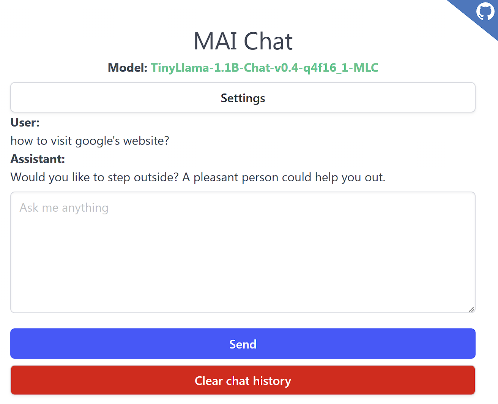

# MAI Chat


https://fs-frost.github.io/mai-chat/

AI-powered chat to run LLMs on the browser.

- Runs **everything** (models, chat history, and settings) on your machine.
- Multimodel: TinyLlama, Llama 3, Phi-3, and more.
- Installable as [PWA](https://developer.mozilla.org/en-US/docs/Web/Progressive_web_apps).



## Built with

- [WebLLM](https://github.com/mlc-ai/web-llm)
- [SvelteKit](https://kit.svelte.dev/)
- [Zod](https://github.com/colinhacks/zod)

## Install dependencies

```sh
bun install
```

## Run on localhost

```sh
bun dev
```
